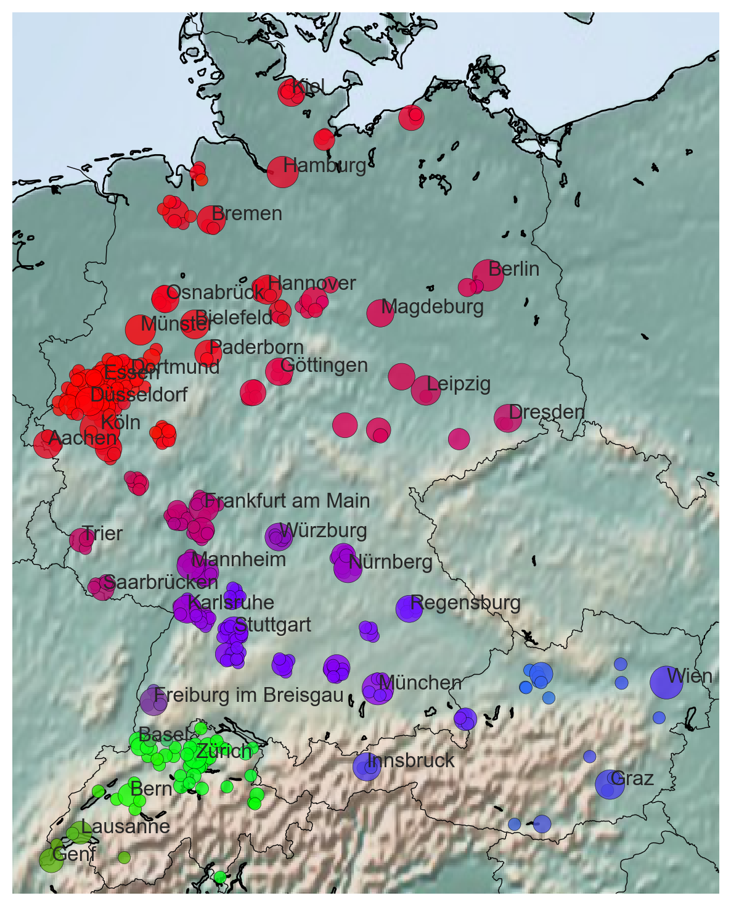

# Capturing Regional Variation with Distributed Place Representations and Geographic Retrofitting



## Abstract
Dialects are one of the main drivers of language variation, a major challenge for natural language processing tools. 
In most languages, dialects exist along a continuum, and are commonly discretized by combining the extent of several preselected linguistic variables.
However, the selection of these variables is theory-driven and itself insensitive to change.
We use Doc2Vec on a corpus of 16.8M anonymous online posts in the German-speaking area to learn continuous document representations of cities. These representations capture continuous regional linguistic distinctions, and can serve as input to downstream NLP tasks sensitive to regional variation. 
By incorporating geographic information via retrofitting and agglomerative clustering with structure, we recover dialect areas at various levels of granularity. Evaluating these clusters against an existing dialect map, we achieve a match of up to 0.77 V-score (harmonic mean of cluster completeness and homogeneity).
Our results show that representation learning with retrofitting offers a robust general method to automatically expose dialectal differences and regional variation at a finer granularity than was previously possible. 

## Setup
Due to space constraints, neither the data nor the model could be included in the repository. Before executing any commands, please run

```
sh get_data.sh
```

and 

```
sh train_model.sh
```

## References
The paper appeared at EMNLP 2018:
* **Dirk Hovy and Christoph Purschke**. 2018. *Capturing Regional Variation with Distributed Place Representations and Geographic Retrofitting*. In Proceedings of EMNLP.

```bib
@inproceedings{HovyPurschke2018capturing,
  title={{Capturing Regional Variation with Distributed Place Representations and Geographic Retrofitting}},
  author={Hovy, Dirk and Purschke, Christoph},
  booktitle={Proceedings of the 2018 conference on Empirical Methods in Natural Language Processing},
  year={2018}
}
```
